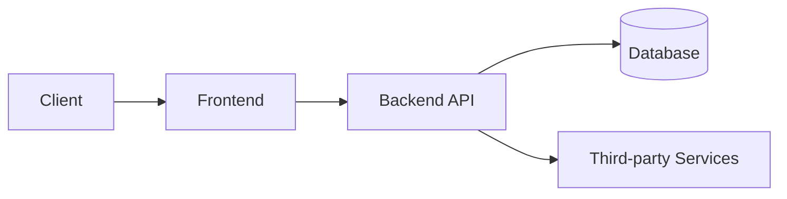

# Architecture — [Project Name]

> 開 repo 嗰日就要有呢頁。最少一頁，用 Mermaid 畫都得。

## 系統概覽

## 主要組件

| 組件 | 技術 | 用途 |
|------|------|------|
| Frontend | | |
| Backend | | |
| Database | | |

## 數據流

<!-- 描述主要 user journey 嘅數據流 -->

## 部署架構

<!-- 環境、hosting、CI/CD 流程 -->

## 技術決策（ADR）

見 [docs/adr/](adr/) — 每個重要技術決策記低原因，方便日後 audit。
